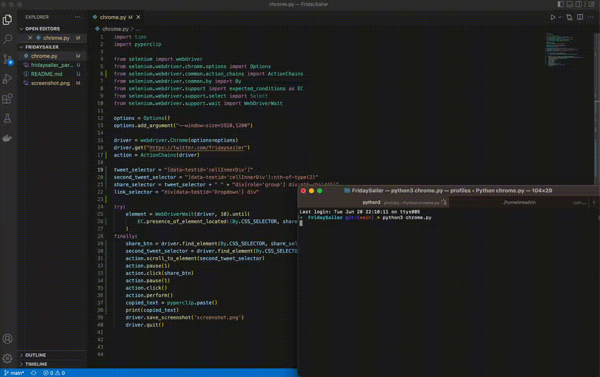

# Friday Sailer

## Use Selenium to scrape the last tweet URL

Twitter API base tier is write only and we would be unable to use the API to get the last n tweets from the user. As such our workaround is to try to scrape the URL from the user's Twitter page. 

The URL is not actually embedded in the HTML of the Twitter page, rather it's copied to the clipboard via an async request. As such we use Selenium to recreate the browser events to click through the user's Twitter page, specifically the *share button* of the last tweet and then the *copy URL item* from the menu:

```python
    share_btn = driver.find_element(By.CSS_SELECTOR, share_selector)
    second_tweet_selector = driver.find_element(By.CSS_SELECTOR, second_tweet_selector)
    action.scroll_to_element(second_tweet_selector)
    action.pause(1)
    action.click(share_btn)
    action.pause(1)
    action.click()
    action.perform()
    copied_text = pyperclip.paste()
    print(copied_text)
```



## Demo
https://youtu.be/tFSkc74ynsE